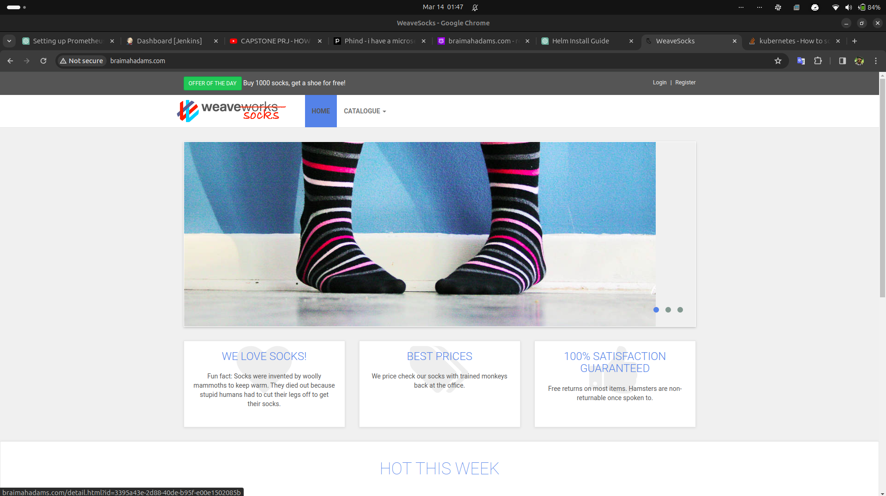

# Deploying the Socks Shop Demo Application on Kubernetes with Jenkins CI/CD

This document outlines the process I followed to deploy the Socks Shop demo application on a Kubernetes cluster using Jenkins for CI/CD. The deployment involved setting up an EKS cluster on AWS, configuring Jenkins, and automating the deployment process.

## Prerequisites

- Cloned the demo microservice repository from GitHub.
- Obtained necessary manifests for deployment including:
  - `complete-demo.yaml`
  - `monitoring` folder (containing Prometheus and Grafana manifest files)
  - `alert-manager` folder (containing Alert Manager manifest files)
  - created `cluster-autoscaler` folder with all necessary manifest files
  - created `priority.yaml`
  - created Ingress resource YAML file for routing traffic to the front-end service
- Installed and configured Helm for managing Kubernetes applications.

## Setup

### 1. Deployed the Application Locally for Testing
- Placed the required manifests in my local directory.
- Created a Kubernetes cluster using `eksctl`.
- Installed the Ingress Controller using Helm.
- Utilized a bash script to retrieve the AWS Load Balancer DNS address for the ingress controller and update DNS records. 
- Deployed the application using `kubectl` with the `manifest files`. 
- I verified that the application was accessible using the DNS `braimahadams.com`. This step confirmed that the DNS settings and ingress resource were correctly configured and that the application was reachable over the internet.  
- I confirmed that Prometheus was successfully scraping metrics from the application endpoints. This was done by checking the Prometheus dashboard and ensuring that the metrics related to the application services were being collected and displayed. 
- I accessed the Grafana dashboard by port-forwarding the Grafana service to my local machine. This allowed me to visually inspect the metrics collected by Prometheus and create custom dashboards to monitor the application's performance and health metrics.  

### 2. Integration with Jenkins CI/CD
- After successfully testing the application locally and ensuring everything worked fine, it was time to leverage Jenkins for automating the deployment process.
- Created a droplet on Digital Ocean to use as the Jenkins server.
- Installed Docker and ran Jenkins using Docker for easy setup, ensuring necessary ports were opened and volumes were mounted. 
- Logged in to Jenkins, added necessary default plugins.
- Configured Jenkins with necessary plugins and tools (Terraform, Helm, kubectl, AWS CLI).
- Entered the Jenkins container as root user and installed required tools  (Terraform, Helm, kubectl, AWS CLI, etc...)

### 3. Configured Jenkins CI/CD Pipeline

- Scripted a Jenkinsfile to automate the deployment process, including provisioning the EKS cluster with terraform, deploying the application, and cleaning up resources. 
- I utilized an external Groovy script to enhance the readability and manageability of the Jenkinsfile. 

### 4. Integrated GitHub with Jenkins

- Installed the Generic Webhook Trigger plugin in Jenkins to facilitate the integration with GitHub.
- Configured GitHub to trigger a build in Jenkins whenever a push change is made to the repository. This was achieved by setting up a webhook in GitHub that points to the Jenkins environment URL.

### 5. Automated Deployment with Jenkins

- After finalizing the Jenkinsfile and all related configurations, I pushed the changes to the GitHub repository. This action triggered Jenkins builds automatically.
- Debugged any errors and ensured successful deployment.  
- Destroyed the EKS cluster after successful testing. 

## Screenshots

- **Jenkins Dashboard**: 
- **GitHub OAuth Configuration**: 

## Conclusion

This document details how I deployed a microservices-based application like Socks Shop on Kubernetes using Jenkins. By automating the deployment process, emphasizing efficiency and reliable deployments.
